# Startup Atlas — Complete Build Plan

> Companion to [`CLAUDE.md`](./CLAUDE.md) — that file is the full spec (schema, architecture,
> rationale). This file is the **complete execution order**: every file in the project, what it's
> responsible for, what it imports from what, and the sequence to build them in. No time-box —
> phases are ordered by dependency and risk, not by a clock. Read a row, code it, check it off,
> move to the next.
>
> **Golden rule stays locked:** cut *features* under real pressure, never *data trust*. Nothing in
> this plan touches sourced facts, precision labelling, or the no-fake-pin rule.

> **Note on the Master Spec artifact:** an earlier "72-hour plan" artifact (diagrams/mockups from
> the Cowork session) treats Typesense, Razorpay escrow, subscriptions, and the warm-path graph as
> immediate v1 work, and makes the Telegram bot — not the admin panel — the control plane.
> `CLAUDE.md` deliberately supersedes that: it demotes all of those to later-phase/roadmap work and
> locks the **admin panel** as the control plane, with the bot as an optional one-way notifier. This
> plan follows `CLAUDE.md` throughout — including here, where the full admin panel (Phase 4) is
> built for real instead of stubbed.

---

## Part 1 — Module dependency map

How the pieces of the monorepo actually talk to each other. Read this once before touching Phase
2 onward — every phase below builds along these arrows.

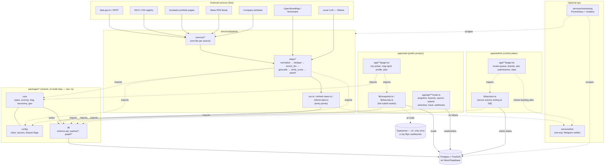

**The one rule that keeps this simple:** `packages/db` is the only place SQL lives. Every other
package/app imports typed functions from it — nobody else writes a raw query against Postgres.
`packages/core` and `packages/config` have zero dependencies on anything else in the repo (pure
types/logic/data) — that's what makes them safely shared by the pipeline, the web app, and the
admin app without circular imports.

---

## Part 2 — Full project file tree

Status tags: **done** = built and verified this session · **next** = the next thing to build ·
**planned** = designed here, not yet started.

```
startup-atlas/
├─ apps/
│  ├─ web/                                    # public product
│  │  ├─ package.json                         # done
│  │  ├─ next.config.mjs                      # done
│  │  ├─ tsconfig.json                        # done
│  │  ├─ tailwind.config.ts                   # done
│  │  ├─ postcss.config.js                    # done
│  │  ├─ app/
│  │  │  ├─ layout.tsx                        # done
│  │  │  ├─ globals.css                       # done
│  │  │  ├─ page.tsx                          # next  (Phase 2 — city picker)
│  │  │  ├─ sitemap.ts                        # planned (Phase 6)
│  │  │  ├─ robots.ts                         # planned (Phase 6)
│  │  │  ├─ privacy/page.tsx                  # planned (Phase 6)
│  │  │  ├─ terms/page.tsx                    # planned (Phase 6)
│  │  │  ├─ submit/page.tsx                   # planned (Phase 3)
│  │  │  ├─ advertise/page.tsx                # planned (Phase 5)
│  │  │  ├─ [city]/
│  │  │  │  ├─ page.tsx                       # next  (Phase 2 — map + grid)
│  │  │  │  ├─ jobs/page.tsx                  # planned (Phase 3)
│  │  │  │  └─ company/[slug]/page.tsx        # next  (Phase 2 — SSR profile)
│  │  │  └─ api/
│  │  │     ├─ snapshot/[city]/route.ts       # next  (Phase 2 — empty placeholder exists)
│  │  │     ├─ bounds/route.ts                # planned (Phase 10)
│  │  │     ├─ search/route.ts                # planned (Phase 10)
│  │  │     ├─ ads/route.ts                   # planned (Phase 5)
│  │  │     ├─ advertise/route.ts             # planned (Phase 5)
│  │  │     ├─ submit/route.ts                # planned (Phase 3)
│  │  │     ├─ track/route.ts                 # planned (Phase 6)
│  │  │     ├─ connect/route.ts               # planned (Phase 9, v2)
│  │  │     └─ webhooks/razorpay/route.ts     # planned (Phase 8/9, v2)
│  │  ├─ components/
│  │  │  ├─ CityPicker.tsx                    # planned (Phase 2)
│  │  │  ├─ TopBar.tsx                        # planned (Phase 2)
│  │  │  ├─ CityExplorer.tsx                  # planned (Phase 2)
│  │  │  ├─ MapView.tsx                       # planned (Phase 2)
│  │  │  ├─ PrecisionBadge.tsx                # planned (Phase 2)
│  │  │  ├─ VerifiedBadge.tsx                 # planned (Phase 2)
│  │  │  ├─ ContactsList.tsx                  # planned (Phase 3)
│  │  │  ├─ JobCard.tsx                       # planned (Phase 3)
│  │  │  ├─ NewsPanel.tsx                     # planned (Phase 3)
│  │  │  ├─ SponsorBar.tsx                    # planned (Phase 5)
│  │  │  ├─ AdSlot.tsx                        # planned (Phase 5)
│  │  │  └─ forms/
│  │  │     ├─ SubmitForm.tsx                 # planned (Phase 3)
│  │  │     ├─ AdvertiseForm.tsx              # planned (Phase 5)
│  │  │     └─ ConnectModal.tsx               # planned (Phase 9, v2)
│  │  └─ lib/
│  │     ├─ snapshot.ts                       # done  (the hybrid loader)
│  │     ├─ bounds.ts                         # planned (Phase 10 — the flip's other half)
│  │     ├─ search.ts                         # planned (Phase 10, v2)
│  │     ├─ analytics.ts                      # planned (Phase 6)
│  │     └─ payments.ts                       # planned (Phase 8/9, v2)
│  │
│  └─ admin/                                  # control plane
│     ├─ package.json                         # planned (Phase 4)
│     ├─ middleware.ts                        # planned (Phase 4 — auth gate)
│     ├─ app/
│     │  ├─ layout.tsx                        # planned (Phase 4)
│     │  ├─ page.tsx                          # planned (Phase 4 — dashboard/stats)
│     │  ├─ login/page.tsx                    # planned (Phase 4)
│     │  ├─ review/page.tsx                   # planned (Phase 4 — the review queue)
│     │  ├─ brands/page.tsx                   # planned (Phase 4 — bulk browse/edit)
│     │  ├─ brands/[id]/page.tsx              # planned (Phase 4 — single edit form)
│     │  ├─ submissions/page.tsx              # planned (Phase 4)
│     │  ├─ ads/page.tsx                      # planned (Phase 4 — approve waitlisted)
│     │  ├─ ingest/page.tsx                   # planned (Phase 4 — run-ingest trigger)
│     │  └─ api/auth/route.ts                 # planned (Phase 4)
│     └─ lib/
│        ├─ auth.ts                           # planned (Phase 4)
│        └─ actions.ts                        # planned (Phase 4 — server actions)
│
├─ services/
│  ├─ pipeline/                               # runs on the ingestion machine
│  │  ├─ package.json                         # done
│  │  ├─ tsconfig.json                        # done
│  │  └─ src/
│  │     ├─ run.ts                            # done  (discovery entry point)
│  │     ├─ refresh-news.ts                   # done
│  │     ├─ refresh-jobs.ts                   # planned (Phase 7)
│  │     ├─ types.ts                          # done
│  │     ├─ sources/
│  │     │  ├─ index.ts                       # done  (registers collectors)
│  │     │  ├─ incubators.ts                  # done  (Venture Center — 124 brands live)
│  │     │  ├─ bhau.ts                        # planned (Phase 7)
│  │     │  ├─ msins.ts                       # planned (Phase 7)
│  │     │  ├─ sine.ts                        # planned (Phase 7)
│  │     │  ├─ ninetyone_springboard.ts       # planned (Phase 7)
│  │     │  ├─ dpiit.ts                       # planned (Phase 7)
│  │     │  ├─ mca.ts                         # planned (Phase 7)
│  │     │  ├─ company_site.ts                # planned (Phase 7)
│  │     │  └─ news_rss.ts                    # done  (feeds only, not a brand collector)
│  │     ├─ steps/
│  │     │  ├─ normalize.ts                   # done
│  │     │  ├─ dedupe.ts                      # done
│  │     │  ├─ enrich_llm.ts                  # done
│  │     │  ├─ geocode.ts                     # done
│  │     │  ├─ verify_score.ts                # done
│  │     │  ├─ upsert.ts                      # done
│  │     │  ├─ refresh_news.ts                # done
│  │     │  ├─ refresh_jobs.ts                # planned (Phase 7)
│  │     │  ├─ verify_legal_entity.ts         # planned (Phase 7)
│  │     │  └─ reindex_search.ts              # planned (Phase 10, v2)
│  │     └─ lib/
│  │        ├─ retry.ts                       # done
│  │        ├─ nominatim.ts                   # done
│  │        ├─ llm.ts                         # done
│  │        ├─ telegram.ts                    # planned (Phase 6, optional)
│  │        └─ typesense.ts                   # planned (Phase 10, v2)
│  │
│  ├─ bot/                                    # optional one-way notifier
│  │  └─ src/index.ts                         # planned (Phase 6) — or just call
│  │                                          #   lib/telegram.ts directly, see Phase 6 note
│  └─ monitoring/                             # optional
│     ├─ docker-compose.yml                   # planned (Phase 7, optional)
│     └─ prometheus.yml                       # planned (Phase 7, optional)
│
├─ packages/
│  ├─ config/
│  │  └─ src/
│  │     ├─ index.ts                          # done
│  │     ├─ cities.ts                         # done
│  │     ├─ sectors.ts                        # planned (Phase 3 — taxonomy for filters)
│  │     └─ env.ts                            # planned (Phase 6 — typed env access)
│  │
│  ├─ core/
│  │  └─ src/
│  │     ├─ index.ts                          # done
│  │     ├─ types.ts                          # done
│  │     ├─ scoring.ts                        # done
│  │     ├─ slug.ts                           # done
│  │     ├─ taxonomy.ts                       # planned (Phase 3 — sector/stage canon)
│  │     └─ geo/precision.ts                  # planned (Phase 10 — bbox/distance helpers)
│  │
│  └─ db/
│     ├─ schema.sql                           # done  (live on Neon)
│     ├─ index.ts                             # done
│     ├─ seed/
│     │  ├─ cities.sql                        # done  (live on Neon)
│     │  └─ areas.sql                         # planned (Phase 7 — named localities)
│     ├─ migrations/
│     │  ├─ 0001_recruiter_subscriptions.sql  # planned (Phase 8, v2 — new tables)
│     │  └─ 0002_person_connections.sql       # planned (Phase 11, v2 — new tables)
│     ├─ queries/
│     │  ├─ brands.ts                         # done
│     │  ├─ jobs.ts                           # done
│     │  ├─ contacts.ts                       # done
│     │  ├─ news.ts                           # planned (Phase 3)
│     │  ├─ ads.ts                            # planned (Phase 5)
│     │  └─ admin.ts                          # planned (Phase 4)
│     └─ graph/
│        └─ warm_path.ts                      # planned (Phase 11, v2)
│
├─ infra/
│  ├─ pmtiles/                                # planned (fast-follow after Phase 2 —
│  │                                          #   see Phase 2 note; not launch-blocking)
│  ├─ nominatim/                              # planned (only if you outgrow the public
│  │                                          #   rate limit — see CLAUDE.md §15)
│  └─ deploy/
│     └─ .github/workflows/
│        ├─ refresh-jobs.yml                  # planned (Phase 7)
│        ├─ refresh-news.yml                  # planned (Phase 7)
│        └─ discovery.yml                     # planned (Phase 7)
│
├─ pnpm-workspace.yaml                        # done
├─ turbo.json                                 # done
├─ tsconfig.base.json                         # done
├─ CLAUDE.md                                  # done (source of truth)
└─ BUILD_PLAN.md                              # this file
```

---

## Phase 1 — Data Foundation Live + App Skeleton ✅ DONE

**Goal:** Postgres live and being filled by the pipeline; the Next.js app exists and can read
from that DB.

> **Status:** `brands` has **124 real rows** ingested from Venture Center's live portfolio (142
> found, 124 after dedupe), all in `review` status with honest `synthetic` precision, waiting for
> admin approval (Phase 4) before they'd ever reach a public query. `apps/web` boots and all 5
> workspace packages typecheck clean.

| # | File | Responsible for | Libraries | Hints |
|---|---|---|---|---|
| 1 | `packages/db/schema.sql` | Every table/enum/index from CLAUDE.md §5 | `psql` / Supabase/Neon SQL editor | Live — verified all 22 tables + PostGIS on the Neon DB in `.env`. |
| 2 | `packages/db/seed/cities.sql` | `pune`/`mumbai` rows in `cities` | same | Seeded — both cities confirmed present. |
| 3 | `packages/db/queries/brands.ts` | `getPublishedBrands(cityId)`, `getBrandBySlug(cityId, slug)`, `getAllPublishedSlugs()` | `pg` via `getPool()`, `@startup-atlas/core` for types | Filters `status IN ('published','probable')` — never exposes `review`/`archived` outside admin. Joins `offices` in one round trip; assumes one office per brand (true — `upsert.ts` deletes+reinserts per run). |
| 4 | `packages/db/queries/jobs.ts` | `getOpenJobs(cityId)` | `pg` | Walk-ins sort first. |
| 5 | `packages/db/queries/contacts.ts` | `getPublicContacts(brandId)` | `pg` | `is_public = true AND opted_out = false` enforced in the query itself. |
| 6 | `services/pipeline/src/sources/news_rss.ts` | Fetches/parses RSS, returns plain `NewsItem[]` — no brand matching | `rss-parser` | One dead feed doesn't kill the others (each wrapped in try/catch). |
| 7 | `services/pipeline/src/steps/refresh_news.ts` + `refresh-news.ts` | Upserts `news_articles`, links to existing brands by name substring match | `@startup-atlas/db` | Kept separate from brand discovery — matching a headline to a *new* brand risks inventing companies from noisy text. Run: `pnpm --filter services-pipeline run refresh-news pune`. |
| 8 | Backfill run | Fills the DB | — | `pnpm --filter services-pipeline run start pune` → 124 brands landed, all `review` tier (score 36 = website +20, domain +8, description +8; no sector/stage/founded_year yet, all `synthetic` precision — no addresses in this source). |
| 9 | `apps/web/package.json` | Declares the Next.js app as a workspace package | `next@^15`, `react@^19`, `maplibre-gl`, `tailwindcss@^3`, `zod` | Named plain `web` — `turbo.json` picks it up automatically. |
| 10 | `next.config.mjs` etc. | Next.js App Router scaffold | `next`, `tailwindcss`, `postcss`, `autoprefixer` | **`transpilePackages: ["@startup-atlas/core","@startup-atlas/config","@startup-atlas/db"]` is required** — those packages ship raw `.ts`, Next won't bundle them without it. |
| 11 | `app/layout.tsx` + `globals.css` | Root shell, Tailwind | — | Thin — no `TopBar` yet, that's Phase 2. |
| 12 | `apps/web/lib/snapshot.ts` | **The hybrid switch** (CLAUDE.md §4/§6) | `@startup-atlas/db`, `@startup-atlas/config` | `{ city, brands, facets }`, facets via `Set` over already-fetched brands. |

**Three real bugs found and fixed — know about these:**

1. `packages/{core,config,db}/package.json` were missing `"type": "module"`. ESM `export` syntax +
   no `"type"` field = Node treats the package as CommonJS when imported from an ESM consumer
   (`services/pipeline`), and named imports fail **at runtime only** — `tsc --noEmit` never catches
   this. Fixed by adding `"type": "module"` to all three.
2. `tsx` doesn't auto-load `.env`. Fixed with Node's built-in `--env-file=../../.env` flag on the
   pipeline's `start`/`refresh-news` scripts (no `dotenv` dependency needed).
3. `venturecenter.co.in/portfolio/` was a dead URL (404). The live site is on the `www` subdomain
   at `www.venturecenter.co.in/startups-and-success-stories/startups`, with different selectors
   (`.startups-list article`). Fixed in `sources/incubators.ts`, verified against live HTML.

---

## Phase 2 — Core Read Path (Map, Grid, Company Profile)

**Goal:** `localhost:3000` shows Pune's pins on a map, filters/searches them in memory, and a
click lands on a server-rendered company profile.

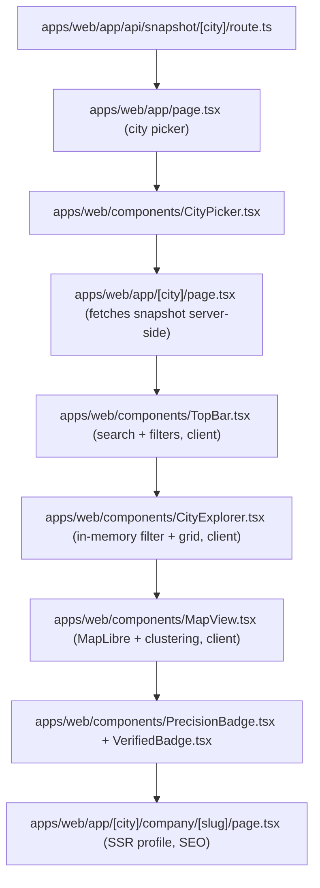

| # | File | Responsible for | Libraries | Hints |
|---|---|---|---|---|
| 1 | `app/api/snapshot/[city]/route.ts` | Thin HTTP wrapper around `lib/snapshot.ts`, edge-cached | Next.js Route Handlers | `export const revalidate = 300;` for now — real ISR tuning is post-launch. An empty placeholder file already exists here from scaffolding — fill it in. |
| 2 | `app/page.tsx` | Screen 1 — city picker landing (FR-1) | Server Component | Pune + Mumbai cards; "detect location" and search-to-city can come later, not launch-blocking. |
| 3 | `components/CityPicker.tsx` | Renders the two city cards, links to `/pune` / `/mumbai` | — | Plain `<Link href={\`/${city.id}\`}>`. Server component, no client state needed. |
| 4 | `app/[city]/page.tsx` | Screen 2 — fetches the snapshot server-side (direct import of `lib/snapshot.ts`), passes it down | — | `notFound()` from `next/navigation` if `cityId` isn't in `packages/config`'s `cities` list. |
| 5 | `components/TopBar.tsx` | Control bar (FR-3): search, type/area/stage/sector dropdowns, map/grid toggle, jobs count | `useState` | Client component (`'use client'`), state-only, no fetching. Lift filter state up to `CityExplorer`. Exact copy from the Master Spec mock: 📍 logo + city name · search "Search startups, sectors, founders…" · 4 filter pills ("All types ▾ / All areas ▾ / All stages ▾ / All sectors ▾") · Map/Grid toggle · "💼 jobs" live count · "Submit" button. |
| 6 | `components/CityExplorer.tsx` | Owns filter state, filters the in-memory snapshot, renders grid or map | — | The in-memory filtering CLAUDE.md §8 describes — no server round-trip per keystroke. `useMemo` the filtered list. |
| 7 | `components/MapView.tsx` | MapLibre map: clustered, precision-aware pins | `maplibre-gl` | Vanilla `maplibre-gl` (skip `react-map-gl`), `useRef` + `useEffect` to init once. Basemap: a free public style URL for now — self-hosting PMTiles (`infra/pmtiles/`) is real infra work and a fast-follow, not a blocker (CLAUDE.md §15 already flags it as a long pole). Clustering: MapLibre's **built-in** `cluster: true` GeoJSON source option, no Supercluster. Color pins by `precision` (exact/building/street = solid, area/synthetic = faded ring) — this *is* the trust feature. |
| 8 | `components/PrecisionBadge.tsx`, `VerifiedBadge.tsx` | Small reusable badges shown on cards and the profile page | — | `PrecisionBadge` renders the honest label ("exact location" vs "approximate — area centroid"); `VerifiedBadge` shows `last_verified_at` relative time. Both pure presentational, take props, no data fetching. |
| 9 | `app/[city]/company/[slug]/page.tsx` | Screen 3 — SSR company profile (FR-4), the SEO surface | `@startup-atlas/db` | Fetch **directly from Postgres** (fresher than the snapshot, and this is where crawlers land). `generateMetadata()` for title/description. Show precision honestly — if `synthetic`, say so. |

**Done-when:** `localhost:3000/pune` shows pins; clicking a pin/card opens
`/pune/company/<slug>` with real SSR data (visible in view-source, not just client JS).

---

## Phase 3 — Jobs, Contacts, News Panel, Submit

**Goal:** every trust surface from CLAUDE.md is visible on the site — sourced contacts, real job
postings, linked news, and a way for the public to submit/claim a company.

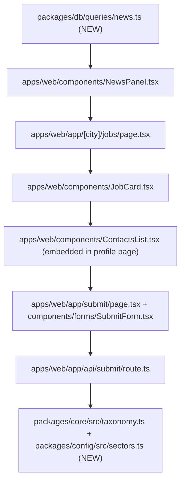

| # | File | Responsible for | Libraries | Hints |
|---|---|---|---|---|
| 1 | `packages/db/queries/news.ts` | `getCompanyNews(brandId)` — joins `company_news` → `news_articles` | `pg` | Order by `published_at desc`; this is what Phase 1's `refresh_news` step populates. |
| 2 | `components/NewsPanel.tsx` | Renders linked news on the profile page and/or a city-wide feed (FR-7) | — | If a brand has zero linked articles, render nothing — don't show an empty panel. |
| 3 | `app/[city]/jobs/page.tsx` | Jobs + walk-ins list (FR-6) | `queries/jobs.ts` | Server component, sort walk-ins first — the differentiator vs. stub job boards. |
| 4 | `components/JobCard.tsx` | One job/walk-in card | — | Walk-ins get a distinct visual treatment (venue + date prominent) vs. a plain apply link. |
| 5 | `components/ContactsList.tsx` | Free HR/careers/leadership directory on the profile page (FR-5) | `queries/contacts.ts` | Every row shows its `source_url` next to it (provenance) plus a visible opt-out link. |
| 6 | `app/submit/page.tsx` + `components/forms/SubmitForm.tsx` | Submit/claim company form (FR-9) | React form, `zod` | Hidden honeypot field (`display:none`, bots fill it, humans don't) — reject server-side if non-empty. |
| 7 | `app/api/submit/route.ts` | Validates + inserts into `submissions` | `zod`, `@startup-atlas/db` | Re-check the honeypot server-side (never trust client-only validation). Store raw form data in the `raw JSONB` column so nothing is lost even on a field mismatch. |
| 8 | `packages/core/src/taxonomy.ts` + `packages/config/src/sectors.ts` | Canonical sector/stage lists, used by both the submit form's dropdowns and the pipeline's `verify_score` (a matched sector/stage scores higher) | — | One source of truth for "what counts as a sector" — the pipeline and the UI must agree, or filters silently miss records. |

**Done-when:** a real submission through `/submit` lands in `submissions`; a profile page shows
contacts with sources, linked news, and any open jobs for that company.

---

## Phase 4 — Admin Panel (the control plane)

**Goal:** the professional admin panel CLAUDE.md §6/§10 describes — review, edit, add, approve
ads, stats, run-ingest — replacing any need for an interactive bot.

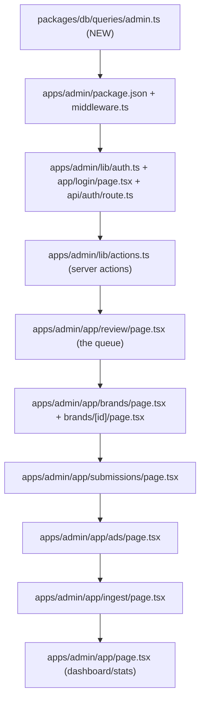

| # | File | Responsible for | Libraries | Hints |
|---|---|---|---|---|
| 1 | `packages/db/queries/admin.ts` | `getBrandsByStatus(status)`, `getSubmissions()`, `getWaitlistedAds()`, `getIngestionRuns()`, `getPageViewStats()` | `pg` | The only place that's allowed to read `review`/`archived` rows — everything public-facing stays on `queries/brands.ts`. |
| 2 | `apps/admin/package.json` + `middleware.ts` | Own Next.js app, gated at the middleware level | `next`, `react` | Same `transpilePackages` requirement as `apps/web`. `middleware.ts` checks a session cookie on every request except `/login`. |
| 3 | `apps/admin/lib/auth.ts` + `app/login/page.tsx` + `api/auth/route.ts` | Single shared-password login, sets a signed cookie compared against `ADMIN_SESSION_SECRET` | Node's built-in `crypto` (timing-safe compare) | Start with one shared password — real per-user auth is a real upgrade later, not launch-blocking as long as the secret is strong and never logged. |
| 4 | `apps/admin/lib/actions.ts` | Server actions: `approveBrand`, `archiveBrand`, `updateBrand`, `approveAd`, `convertSubmission` | Next.js Server Actions, `@startup-atlas/db` | Every action re-validates status transitions server-side (e.g. can't "approve" something already `archived` without an explicit override) — this is the data-trust gate, don't let the UI be the only check. |
| 5 | `app/review/page.tsx` | The review queue — brands where `status = 'review'`, Approve/Edit/Archive per row | — | This is the single most important admin screen — it's what turns `review` rows into public `published`/`probable` ones. Show the score breakdown next to each row so approval is an informed decision, not a guess. |
| 6 | `app/brands/page.tsx` + `brands/[id]/page.tsx` | Bulk browse/search across all brands regardless of status; full edit form on the detail page | — | This is where a human corrects what the pipeline got wrong (bad geocode, wrong sector) — every field the pipeline writes should be editable here. |
| 7 | `app/submissions/page.tsx` | Review public submissions from `/submit`, convert to a real brand row or reject | — | "Convert" should pre-fill a new/edit brand form from the submission's `raw` JSON rather than making the admin retype everything. |
| 8 | `app/ads/page.tsx` | Approve `ad_bookings` where `status = 'waitlisted'` → `live` | — | Manual step matches Phase 5's manual-UPI ad flow — this is where a payment received outside the app gets reflected in the DB. |
| 9 | `app/ingest/page.tsx` | "Run ingest" trigger | — | Vercel serverless functions can't run a long scraping job inline — this button should call a webhook that queues the job for the pipeline machine (or trigger a GitHub Actions `workflow_dispatch`, see Phase 7), not attempt to scrape from within the request. |
| 10 | `app/page.tsx` | Dashboard — review backlog count, recent `ingestion_runs`, basic `page_views` stats | `queries/admin.ts` | This is the free first-party stats view CLAUDE.md §10 describes — it doesn't need PostHog to be useful. |

**Done-when:** an admin can log in, see the 124 `review` brands from Phase 1, approve one, and it
appears on the public map within the snapshot's cache window.

---

## Phase 5 — Monetization: Ads (manual UPI first)

**Goal:** the first revenue surface live — boosted pins, sponsor tiles, banners — booked manually
before any payment gateway integration.

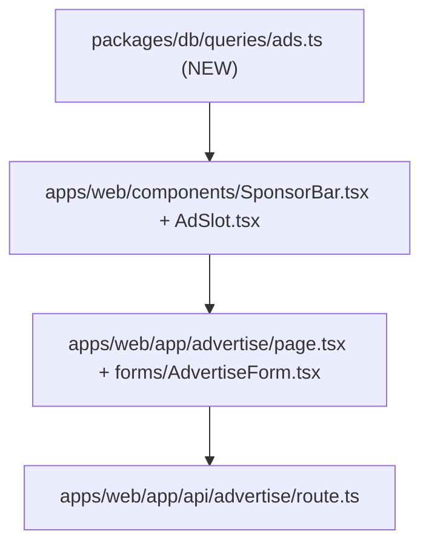

| # | File | Responsible for | Libraries | Hints |
|---|---|---|---|---|
| 1 | `packages/db/queries/ads.ts` | `getLiveAds(cityId, kind)` — rows where `status = 'live'` and within `starts_at`/`ends_at` | `pg` | Filter the date window in SQL, not in the component — an expired ad should never even reach the page. |
| 2 | `components/SponsorBar.tsx` + `AdSlot.tsx` | Render live ads (FR-8) | — | If there are zero live ads, render nothing — never show an empty placeholder box. |
| 3 | `app/advertise/page.tsx` + `forms/AdvertiseForm.tsx` | Booking form (kind, dates, contact email) | React form, `zod` | Same honeypot pattern as `SubmitForm.tsx`. |
| 4 | `app/api/advertise/route.ts` | Inserts an `ad_bookings` row, `status = 'waitlisted'` | `zod`, `@startup-atlas/db` | Manual UPI: the page tells the advertiser "we'll email you a payment link" — Phase 4's `app/ads/page.tsx` is where the admin flips it to `live` once payment is confirmed. |

**Done-when:** a real ad booking lands in `ad_bookings`, an admin approves it in Phase 4's admin
app, and it renders on the live site.

---

## Phase 6 — Observability, Legal, Deploy — Launch

**Goal:** the product is live on a real URL, crawlable, legally minimal-compliant, and you'd know
within minutes if it broke.

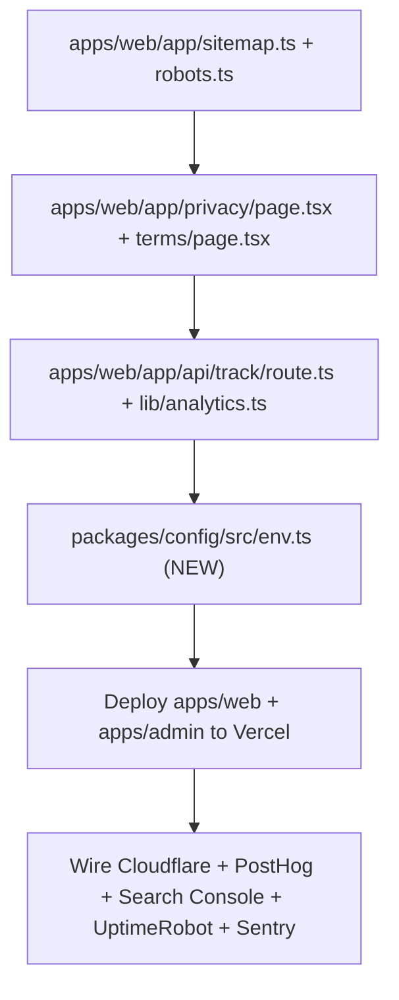

| # | File | Responsible for | Libraries | Hints |
|---|---|---|---|---|
| 1 | `app/sitemap.ts` + `robots.ts` | One route per published company (NFR-SEO) | Next.js built-in sitemap convention | Query `getAllPublishedSlugs()` from Phase 1's `brands.ts` — published only. |
| 2 | `app/privacy/page.tsx` + `terms/page.tsx` | Legal minimum for launch | — | Plain static text is fine to start — you're publishing contact info, so something here is not optional, even if a real legal pass comes later. |
| 3 | `app/api/track/route.ts` + `lib/analytics.ts` | First-party `page_views` insert + a `track()` wrapper components call | `@startup-atlas/db` | This is the "own `page_views` table" CLAUDE.md §10 describes — it's what makes admin's `/stats` (Phase 4) useful without waiting on PostHog setup. |
| 4 | `packages/config/src/env.ts` | Typed, validated access to `process.env` across the whole monorepo | `zod` (`z.object({...}).parse(process.env)`) | Import this everywhere instead of raw `process.env.X` — a missing/misnamed env var fails loudly at startup instead of silently at runtime. |
| 5 | Deploy | Two Vercel projects (`apps/web`, `apps/admin`), same repo, different root directories | Vercel | Set `DATABASE_URL` and `ADMIN_SESSION_SECRET` per project in Vercel's dashboard — never commit them. |
| 6 | Observability wiring | Cloudflare Web Analytics (traffic), PostHog (funnels), Google Search Console (search), Microsoft Clarity (heatmaps), UptimeRobot (uptime), Sentry (errors) | `@sentry/nextjs`, PostHog script tag | ~30 min total per CLAUDE.md §10 — mostly pasting a script tag into `layout.tsx` and verifying in each tool's dashboard. |
| 7 | Telegram notifier (optional) | One-way alert when an ingest fails or the review backlog grows | `services/pipeline/src/lib/telegram.ts` calling the Bot API directly (`fetch`), no bot framework needed | CLAUDE.md §11: keep this to ~5 lines, a webhook ping, not an interactive bot — the admin panel already covers interactive review. |

**Done-when:** production URL loads, `sitemap.xml` lists real company pages, and you'd get paged
(Sentry/UptimeRobot) if the site or the DB went down.

**This is the launch line.** Everything from here on is additive — order Phases 7–11 by whichever
lever (more data, more revenue, more scale) matters most once you have real usage signal, rather
than following this document's sequence blindly.

---

## Phase 7 — Broaden Data Sources + Maintenance Cron

**Goal:** more sources feeding the pipeline, jobs/news staying fresh without the ingestion
machine needing to be awake all the time, Mumbai turned on.

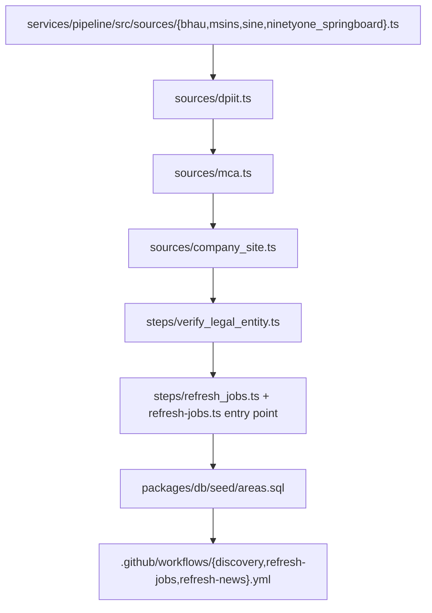

| # | File | Responsible for | Libraries | Hints |
|---|---|---|---|---|
| 1 | `sources/{bhau,msins,sine,ninetyone_springboard}.ts` | One collector per remaining incubator from `packages/config`'s `discoverySources` | `cheerio` | Copy `incubators.ts`'s shape exactly — each site needs its own selectors, inspected live (learned the hard way in Phase 1: don't trust a URL/selector without checking it against the real page first). |
| 2 | `sources/dpiit.ts` | Pulls data.gov.in's recognized-startups dataset as a discovery seed | `fetch` (it's a public API/CSV) | CLAUDE.md §7: "treat DPIIT as a discovery seed, not a census" — cross-reference before publishing, don't auto-trust it more than any other source in `verify_score`. |
| 3 | `sources/mca.ts` | Legal entity verification — populates `legal_entities` + `brand_entity_links` | `fetch`/`cheerio` depending on the MCA endpoint you use | This feeds `verify_score`'s "matched CIN +10" signal — write to `legal_entities` directly, this doesn't go through the `RawRecord` brand pipeline. |
| 4 | `sources/company_site.ts` | Once a brand exists, revisits its own website for HR/careers emails and job postings | `cheerio` | This is what actually populates `company_contacts` at scale — the incubator sources alone don't give you contacts. Always store `source_url` — required by the schema and the trust rule. |
| 5 | `steps/verify_legal_entity.ts` | Cross-references a brand against `legal_entities` by name/domain match | `@startup-atlas/db` | Same "plain substring match, not NLP" philosophy as Phase 1's news matching — good enough, keep it simple. |
| 6 | `steps/refresh_jobs.ts` + `refresh-jobs.ts` | Re-visits each brand's careers page, upserts new postings, expires ones no longer seen | `@startup-atlas/db`, `cheerio` | Mirror `refresh-news.ts`'s shape — separate entry point, not part of `run.ts`'s discovery loop. |
| 7 | `packages/db/seed/areas.sql` | Named locality centroids per city (`areas` table) | — | Better `synthetic` fallback than the raw city centroid — "Koregaon Park, Pune" reads as more honest than "Pune" when a real address isn't available. |
| 8 | `.github/workflows/*.yml` | Move jobs/news/discovery refreshes off the always-on-laptop requirement | GitHub Actions, `workflow_dispatch` + `schedule` cron | CLAUDE.md §12 phase 2: jobs daily, news daily, discovery weekly. This is also what Phase 4's "run ingest" button can trigger on demand via `workflow_dispatch`. |
| 9 | *(action)* Mumbai | Flip on the second city | — | Zero rework — `mumbai` is already seeded and configured with `useBounds: false`. Just run `pnpm --filter services-pipeline run start mumbai` once sources exist for it. |

**Done-when:** at least 3–4 sources are feeding the pipeline, jobs/news refresh on a schedule
without manual intervention, and Mumbai has real data too.

---

## Phase 8 — Self-Serve Ad Checkout + Recruiter Subscriptions

**Goal:** move ads from manual-UPI to real self-serve payment, and add a recurring-revenue tier
for recruiters.

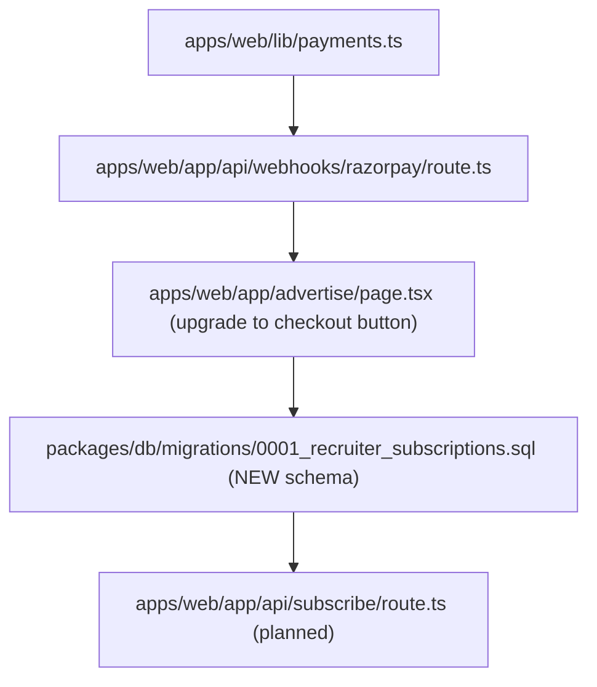

| # | File | Responsible for | Libraries | Hints |
|---|---|---|---|---|
| 1 | `apps/web/lib/payments.ts` | Razorpay Orders API helpers (simple checkout, not Route escrow — that's Phase 9) | `razorpay` npm SDK | This is a plain payment, not a split/escrow — much simpler than what Phase 9 needs. |
| 2 | `app/api/webhooks/razorpay/route.ts` | Verifies webhook signature, marks the matching `ad_bookings` row `live` on payment success | `razorpay` (signature verification helper) | Always verify the webhook signature — never trust an unauthenticated POST to flip a paid status. |
| 3 | `app/advertise/page.tsx` | Upgrade from "we'll email you" to an actual Razorpay checkout button | Razorpay Checkout.js (client-side) | Keep the manual-UPI path as a fallback link — don't force checkout if a customer prefers to pay another way. |
| 4 | `packages/db/migrations/0001_recruiter_subscriptions.sql` | **New schema** — CLAUDE.md's shipped schema doesn't define recruiter/subscription tables yet, this is genuinely new | — | Sketch: `recruiters (id, email, brand_id FK, razorpay_customer_id)`, `subscriptions (id, recruiter_id FK, plan, status, razorpay_subscription_id, current_period_end)`. Write this as a real migration file, not a schema.sql edit — schema.sql is the "day 0" snapshot, everything after goes in `migrations/`. |
| 5 | `app/api/subscribe/route.ts` | Creates a Razorpay subscription, links it to a `recruiters` row | `razorpay` SDK | Gate whatever subscriber-only feature you build (e.g. a recruiter dashboard) behind `subscriptions.status = 'active'`. |

**Done-when:** an advertiser can pay through checkout without you manually flipping a status, and
at least one recruiter subscription can be created and verified end-to-end.

---

## Phase 9 — Paid Connect (Escrow)

**Goal:** the intro-call/resume-review/referral flow from CLAUDE.md §4, money held in escrow via
Razorpay Route until the engineer delivers.

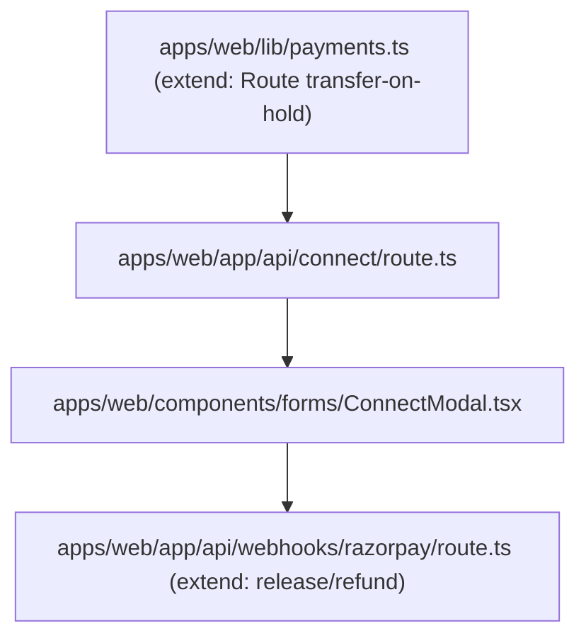

| # | File | Responsible for | Libraries | Hints |
|---|---|---|---|---|
| 1 | `lib/payments.ts` (extend) | Creates a Razorpay order with the transfer **on hold** (escrow), targeting a linked-account (the referrer/engineer) | `razorpay` SDK, Route API | `connect_requests` already exists in the schema (CLAUDE.md §5) — this phase is mostly wiring, not new tables. Requires Razorpay Route KYC to be approved first (start that early — CLAUDE.md §15 flags activation as taking days). |
| 2 | `app/api/connect/route.ts` | Creates a `connect_requests` row, kicks off the escrow order | `zod`, `@startup-atlas/db`, `razorpay` | `status` moves `requested → paid → delivered → released` (or `refunded`) — model this as an explicit state machine, not a free-text field you forget to constrain. |
| 3 | `components/forms/ConnectModal.tsx` | The "request an intro" UI on a company profile | React | If Route KYC isn't done yet, this can launch as a waitlist form (CLAUDE.md's own cut-line) — same component, just skip the payment step until KYC clears. |
| 4 | `app/api/webhooks/razorpay/route.ts` (extend) | Handles transfer release on delivery confirmation, and auto-refund if no delivery within N days | `razorpay` SDK | "No delivery in N days → auto refund" (CLAUDE.md §4) needs a scheduled check — a GitHub Actions cron hitting a `route.ts` endpoint works, same mechanism as Phase 7's maintenance jobs. |

**Done-when:** one real paid-connect request completes the full state machine — requested, paid,
delivered, released — without manual DB surgery.

---

## Phase 10 — Search at Scale: Typesense + Bounds Flip

**Goal:** flip a city from "ship the whole snapshot" to "bounds query + server search" once it
outgrows in-memory filtering — with zero UI rewrite, because Phase 2 was built for exactly this.

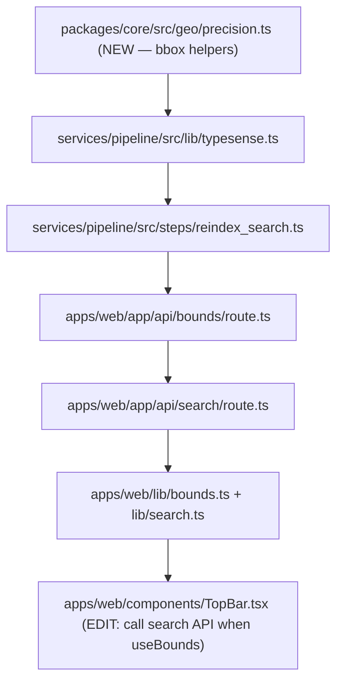

| # | File | Responsible for | Libraries | Hints |
|---|---|---|---|---|
| 1 | `packages/core/src/geo/precision.ts` | Shared bbox/distance helpers (e.g. "is this point inside this viewport rectangle") | — | Small, pure functions — used by both the pipeline's future spatial steps and `apps/web`'s bounds query construction. |
| 2 | `services/pipeline/src/lib/typesense.ts` | Typesense client wrapper | `typesense` npm client | One client instance, reused by `reindex_search.ts`. |
| 3 | `steps/reindex_search.ts` | Pushes published/probable brands into a Typesense collection after every `upsert.ts` run | `@startup-atlas/db`, `typesense` | Only runs for cities where `packages/config`'s `useBounds` is `true` — for snapshot cities this step is a no-op, don't waste API calls indexing data nobody queries through Typesense yet. |
| 4 | `app/api/bounds/route.ts` | PostGIS bounds query — `ST_MakeEnvelope` + `ST_Intersects` against `offices.geom`, paginated | `@startup-atlas/db` | This replaces the snapshot's "ship everything" with "ship what's in the visible map rectangle" — same `BrandListItem` shape as `queries/brands.ts` so components don't care which path served them. |
| 5 | `app/api/search/route.ts` | Thin proxy to Typesense for the search box / facets | `typesense` client | Same query shape the in-memory filter used — `TopBar.tsx` shouldn't need to know which backend answered it. |
| 6 | `apps/web/lib/bounds.ts` + `lib/search.ts` | The other half of the hybrid switch — decides per city (via `city.useBounds`) whether to call `snapshot.ts` or `bounds.ts`/`search.ts` | `@startup-atlas/config` | This is the file CLAUDE.md §4/§6 promises: flipping one city's flag changes its data path with no component rewrite. |
| 7 | `components/TopBar.tsx` (edit) | When `useBounds` is true, search calls `api/search` instead of filtering the in-memory array | — | Keep the exact same UI/props contract — only the data source behind it changes. |

**Done-when:** flipping one city's `useBounds` to `true` in `packages/config/src/cities.ts`
changes its data path (verify via network tab — `api/bounds`/`api/search` firing instead of one
snapshot fetch) with no visible UI change.

---

## Phase 11 — Warm-Path Graph

**Goal:** "who can introduce me" — CLAUDE.md's furthest-out feature, a secondary graph read-model
over the same Postgres data (no Neo4j — locked decision from CLAUDE.md §2).

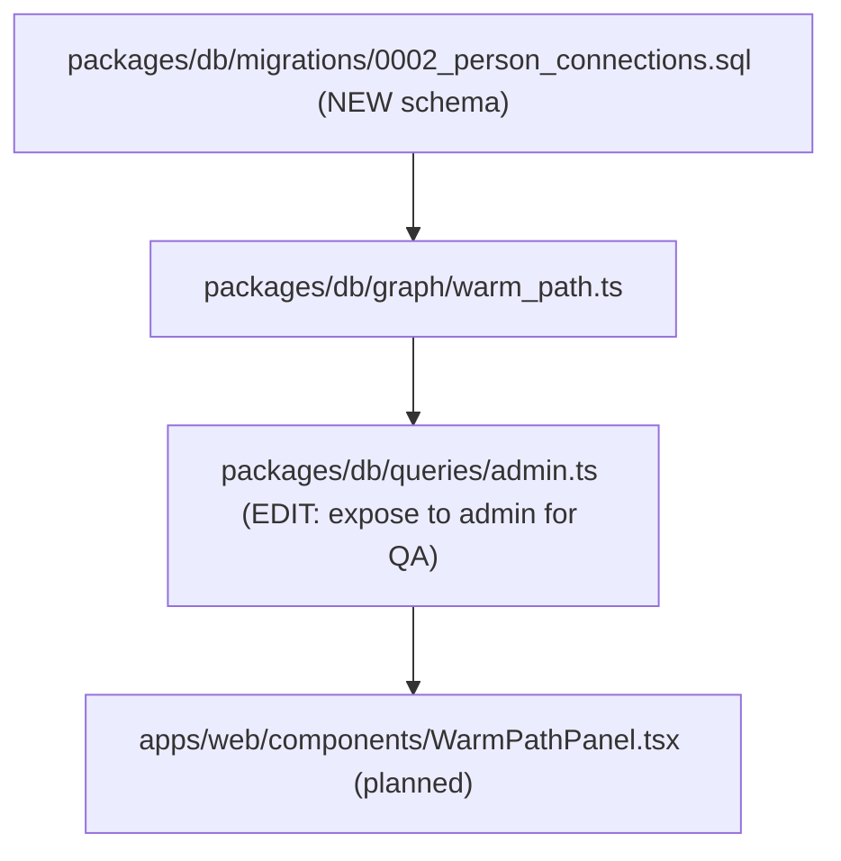

| # | File | Responsible for | Libraries | Hints |
|---|---|---|---|---|
| 1 | `packages/db/migrations/0002_person_connections.sql` | **New schema** — a person-to-person edge table doesn't exist yet; `company_people` alone only gives "worked at the same company," not a real network | — | Sketch: `connections (person_id_a, person_id_b, source, created_at)`. Where these edges come from (LinkedIn import? mutual company overlap only?) is a real product decision to make before writing this file, not a given. |
| 2 | `packages/db/graph/warm_path.ts` | Given a target brand, find people within N hops (self → connection → connection) who can introduce you | Plain PostgreSQL `WITH RECURSIVE` over `connections` + `company_people` | No graph database needed for a 2–3 hop traversal at this scale — this is exactly what CLAUDE.md §2 means by "graph is a later secondary read-model," implemented as SQL, not infrastructure. Cap the recursion depth explicitly (e.g. `WHERE depth <= 2`) or a dense network makes this query blow up. |
| 3 | `queries/admin.ts` (edit) | Expose warm-path results to admin for QA before it ever reaches a public UI | — | Trust matters here too — a wrong "so-and-so can introduce you" is worse than no feature at all. Review real output before shipping the UI. |
| 4 | `components/WarmPathPanel.tsx` | Public UI — "N people in your network could introduce you here" | — | Genuinely last — it depends on real connection data existing, which depends on a product decision (item 1) this plan can't make for you. |

**Done-when:** given two real people with a mutual connection in the DB, `warm_path.ts` correctly
finds the path — verified with real data, not synthetic test rows, before any UI ships.

---

## Non-negotiables (never cut, regardless of phase or pressure)

- **Precision labels** — every pin and profile shows its real `loc_precision`, honestly. A
  `synthetic` pin is never rendered like an `exact` one.
- **Provenance** — every public contact carries its `source_url`. No `source_url`, no publish.
- **Status gating** — public queries (`queries/brands.ts`, `snapshot.ts`, `bounds.ts`) only ever
  read `published`/`probable`. `review`/`archived` rows are admin-only, always.
- **No residential addresses** — MCA/legal-entity addresses stay in `legal_entities`, never surface
  as a public office location.
- **SQL stays in `packages/db`** — every other package/app calls typed functions, never writes a
  raw query against the production database directly.

These are what make the product different from the incumbent it's targeting — everything else in
this plan is negotiable in order or scope; these are not.
