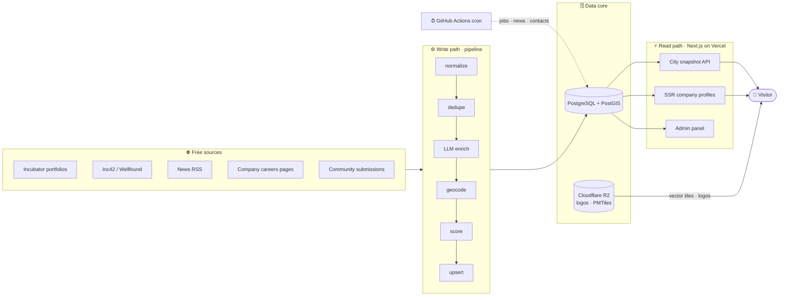

<div align="center">

# 🗺️ Startup Atlas

**A city-by-city map of startups: where they are, who's hiring, and what's happening, with every fact sourced.**

Starting with **Pune** and **Mumbai**, built to scale to any city.


</div>

---

## Table of contents

- [Why this exists](#why-this-exists)
- [What it does](#what-it-does)
- [Tech stack](#tech-stack)
- [Architecture](#architecture)
- [The trust model](#the-trust-model)
- [Repository structure](#repository-structure)
- [Getting started](#getting-started)
- [Data pipeline](#data-pipeline)
- [Scheduled jobs](#scheduled-jobs)
- [Admin panel](#admin-panel)
- [Roadmap](#roadmap)
- [License](#license)

---

## Why this exists

Startup maps already exist, but the ones out there tend to share the same problems:

| Problem | What Startup Atlas does instead |
|---|---|
| **Fake locations.** Pins shown as exact when the real address was never known | Every location stores its **precision** (`exact` → `area` → `synthetic`), and the map shows it honestly |
| **Unsourced data.** No way to tell where a fact came from or when | Every important field has a `field_evidence` row with its **source URL and a timestamp** |
| **Stub job listings.** "Hiring" badges that don't link to a real role | Real postings pulled from companies' **own applicant-tracking systems**, which expire when they're filled |
| **Slow, bloated pages.** The whole database shipped to every browser | A cached per-city snapshot and **self-hosted vector tiles**, with no per-view map API calls |
| **No business model.** Nothing to keep it maintained | Ads, boosted pins, featured jobs and paid connect are in the **schema from day one** |

> **The one rule:** cut *features* under time pressure, never *data trust*.

---

## What it does

- 🏙️ **City picker.** Pick a city, land on its map.
- 🗺️ **Interactive map.** Clustered, precision-aware pins with company logos, a job-count badge on each hiring company, and a grid view.
- 🔎 **Instant filtering.** Search plus type / area / stage / sector filters, run in memory against the city snapshot with no server round-trip.
- 🏢 **Company profiles.** Server-rendered for SEO, showing location precision, a last-verified date, tags and open roles.
- 💼 **Jobs and walk-in interviews.** Live postings from **7 ATS platforms** plus aggregator APIs. Walk-in drives are detected automatically and can be submitted by companies.
- 📇 **Public contact directory.** HR / careers / leadership contacts. Each one needs a source URL and supports opt-out.
- 📰 **News.** RSS-sourced startup news, linked to the companies it mentions.
- 📣 **Ads.** Boosted pins, sponsor tiles, flash ads and banners, booked through a form and approved in the admin panel.
- ✍️ **Self-service listings.** Companies submit or claim their page, update details and post roles (walk-ins included). Every edit goes through review.
- 🛠️ **Admin panel.** Review queue, brand editor, submissions, ads, payments, referrals, stats and a one-click ingest trigger.

---

## Tech stack

| Layer | Technology |
|---|---|
| **Frontend** | Next.js 15 (App Router, React Server Components, ISR), React 19, TypeScript, Tailwind CSS |
| **Maps** | MapLibre GL JS, self-hosted **PMTiles** vector tiles (built with Planetiler from OpenStreetMap), served from Cloudflare R2 |
| **Database** | PostgreSQL + **PostGIS** (spatial indexing), `pg_trgm` (fuzzy name search), hosted on Neon |
| **Backend** | Next.js route handlers and server actions, Zod validation |
| **Data pipeline** | Node.js + TypeScript (`tsx`), Cheerio (HTML parsing), `rss-parser`, ExcelJS |
| **Geocoding** | Nominatim (OpenStreetMap), with an honest area / city-centroid fallback |
| **Enrichment** | Local LLM through Ollama. It only fills gaps and never overwrites a sourced fact |
| **Job sources** | Greenhouse, Lever, Ashby, Workable, Recruitee, Keka, SmartRecruiters, plus the Adzuna and Jooble APIs |
| **Storage** | Cloudflare R2 (S3-compatible) for logos, uploads and map tiles |
| **Automation** | GitHub Actions cron jobs (jobs, news, discovery and contact refreshes) |
| **Monitoring** | Prometheus + Grafana (optional, Docker Compose) and first-party page-view analytics |
| **Tooling** | pnpm workspaces, Turborepo, TypeScript project references |
| **Hosting** | Vercel (web app), Neon (database), Cloudflare R2 (assets) |

---

## Architecture

The core idea is that **the read path and the write path never touch.** Visitors only ever hit cached, indexed data. The slow work of scraping, geocoding, scoring and enriching happens separately in the background.



**Snapshot now, bounds later.** At today's scale, each city is one cached snapshot built from Postgres (`apps/web/lib/snapshot.ts`) and filtered in the browser. Once a city passes about 8,000 records, that one loader switches to viewport (bounding-box) queries and server-side search, and the UI stays the same.

---

## The trust model

Every company record gets a **score from 0 to 100**, built from real evidence, and the score decides whether it's shown:

| Score | Tier | Visibility |
|---|---|---|
| **75–100** | `published` | Shown |
| **55–74** | `probable` | Shown with a limited-info label |
| **35–54** | `review` | Hidden, waits in the admin review queue |
| **< 35** | `archived` | Hidden, never deleted |

**Scoring signals** include a working website, a domain, sector, stage, a description longer than 40 characters, founding year, and location precision (street-level scores highest, while a city centroid scores nothing). Bootstrapped or unfunded startups are **never penalized**: there is deliberately no "has funding" signal.

A few things are **never compromised**:
- A coordinate is **never** shown as more precise than it really is.
- Residential addresses are **never** published.
- Every public contact carries a `source_url` and can be opted out.
- Self-reported data (submissions, walk-in venues) always goes through **human review** before it's published.

---

## Repository structure

```
startup-atlas/
├── apps/
│   └── web/                  # Next.js product + admin panel
│       ├── app/
│       │   ├── page.tsx                    # City picker
│       │   ├── [city]/page.tsx             # Map + grid
│       │   ├── [city]/jobs/                # Jobs + walk-ins
│       │   ├── [city]/company/[slug]/      # SSR company profile
│       │   ├── manage/[city]/[slug]/       # Company self-service page
│       │   ├── admin/(panel)/              # Admin control plane
│       │   ├── submit/  advertise/         # Public forms
│       │   └── api/                        # snapshot, submit, advertise, track …
│       ├── components/       # MapView, CityExplorer, TopBar, forms/ …
│       └── lib/              # snapshot loader, R2, admin actions
├── services/
│   ├── pipeline/             # Ingestion + maintenance jobs
│   │   └── src/
│   │       ├── sources/      # One collector per free source
│   │       ├── steps/        # normalize → dedupe → enrich → geocode → score → upsert
│   │       └── lib/          # ATS clients, aggregators, walk-in parser, geocoder
│   └── monitoring/           # Optional Prometheus + Grafana
├── packages/
│   ├── db/                   # schema.sql, migrations/, queries/ (the only place SQL lives)
│   ├── core/                 # Shared types, scoring, precision, slugs
│   └── config/               # Cities, sectors, stages, feature flags
├── infra/
│   ├── pmtiles/              # Vector tile build
│   └── nominatim/            # Self-hosted geocoder (optional)
└── .github/workflows/        # Scheduled refresh jobs
```

`packages/core` holds the scoring logic, so the pipeline, the web app and the admin panel all rank data the same way.

---

## Getting started

### Prerequisites

- **Node.js ≥ 20** and **pnpm 9**
- A **PostgreSQL** database with the **PostGIS** extension ([Neon](https://neon.tech) and [Supabase](https://supabase.com) both work)
- *(Optional)* [Ollama](https://ollama.com) for local description enrichment
- *(Optional)* A Cloudflare R2 bucket for logos and map tiles

### 1. Install

```bash
git clone https://github.com/Pa04rth/startup_atlas.git
cd startup_atlas
pnpm install
```

### 2. Configure

```bash
cp .env.example .env
```

The main variables:

| Variable | Purpose |
|---|---|
| `DATABASE_URL` | Postgres connection string (use the **pooler** URL) |
| `NEXT_PUBLIC_MAPTILES_URL` | Public URL of your `.pmtiles` file |
| `R2_*` | Cloudflare R2 credentials for logo and upload storage |
| `LLM_BASE_URL` | Ollama endpoint, e.g. `http://localhost:11434` (optional) |
| `ADZUNA_APP_ID` / `ADZUNA_APP_KEY` | [Adzuna](https://developer.adzuna.com) job API (optional, free tier) |
| `JOOBLE_API_KEY` | [Jooble](https://jooble.org/api/about) job API (optional, free) |

See [`.env.example`](./.env.example) for the full list with comments.

### 3. Set up the database

```bash
psql "$DATABASE_URL" -c "create extension if not exists postgis;"
psql "$DATABASE_URL" -f packages/db/schema.sql
psql "$DATABASE_URL" -f packages/db/seed/cities.sql

# Apply migrations in order
for f in packages/db/migrations/*.sql; do psql "$DATABASE_URL" -f "$f"; done
```

### 4. Load data and run the app

```bash
pnpm ingest pune        # collect companies for a city
pnpm dev                # start the web app → http://localhost:3000
```

---

## Data pipeline

Each source is an isolated collector, so one failing source never stops the others. Records flow through the same steps:

```
collect → normalize → dedupe → enrich (LLM) → geocode → score → upsert
```

| Command | What it does |
|---|---|
| `pnpm --filter services-pipeline start <city>` | Full ingest: discover and upsert companies |
| `pnpm --filter services-pipeline refresh-jobs <city>` | Check each company's careers page for a supported ATS board and sync its open roles |
| `pnpm --filter services-pipeline refresh-aggregator-jobs <city>` | Pull Adzuna / Jooble listings and keep only the ones that match a company on the map |
| `pnpm --filter services-pipeline refresh-news` | Ingest startup news from RSS and link it to companies |
| `pnpm --filter services-pipeline refresh-contacts` | Refresh the public HR / careers contact directory |
| `pnpm --filter services-pipeline verify-listings <city>` | Check that each website is live and names the right city (add `--apply` to archive dead sites) |
| `pnpm --filter services-pipeline cache-logos` | Fetch each company's logo once and cache it in R2 |
| `pnpm --filter services-pipeline import-curated` | Import the hand-verified curated dataset |

**How jobs are sourced.** Most job boards publish a free, public JSON feed for embedding on a careers page. The pipeline looks for a board link on a company's own site and reads that feed directly. There is no scraping of LinkedIn, Indeed or Naukri, whose terms prohibit it. Any job title that reads as a **walk-in drive** is flagged, and its venue and date are extracted only when the posting explicitly labels them.

---

## Scheduled jobs

After the first backfill, day-to-day freshness runs on free **GitHub Actions** cron, so no machine has to stay on:

| Workflow | Schedule | Purpose |
|---|---|---|
| `refresh-news.yml` | Daily, about 8:30 IST | Startup news from RSS |
| `refresh-jobs.yml` | Daily, about 9:00 IST | ATS boards + aggregator job APIs, for both cities |
| `discovery.yml` | Weekly, Monday about 9:30 IST | Find newly founded startups |
| `refresh-contacts.yml` | Weekly, Monday after discovery | Public contact directory |

Add `DATABASE_URL` (plus the optional job API keys) as repository secrets under **Settings → Secrets and variables → Actions**.

---

## Admin panel

The control plane lives at **`/admin`** inside the web app, behind a login.

| Section | Use it to |
|---|---|
| **Dashboard** | See traffic, the review backlog and ingestion health |
| **Review queue** | Approve or archive records the scorer wasn't sure about |
| **Brands** | Correct any company's facts by hand |
| **Submissions** | Approve new companies, edit requests and submitted roles |
| **Ads** | Approve, reject or end ad bookings |
| **Payments** | Check manual UPI payment receipts |
| **Referrals** | Moderate referral offers and requests |
| **Run ingest** | Trigger a pipeline run from the browser |

---

## Roadmap

- [x] Per-city map with clustering and precision-aware pins
- [x] Evidence-backed scoring and verification tiers
- [x] Real jobs from 7 ATS platforms + aggregator APIs
- [x] Walk-in interview detection and self-submission
- [x] Admin panel with review, submissions, ads and payments
- [x] Scheduled refreshes on GitHub Actions
- [ ] Self-serve ad checkout (Razorpay)
- [ ] Viewport queries + Typesense server search for large cities
- [ ] Recruiter subscriptions and dashboard
- [ ] Paid connect (intro calls, resume reviews, referrals) through escrow
- [ ] More cities

---

## License

Released under the [MIT License](./LICENSE). © 2026 Parth Sohaney.
